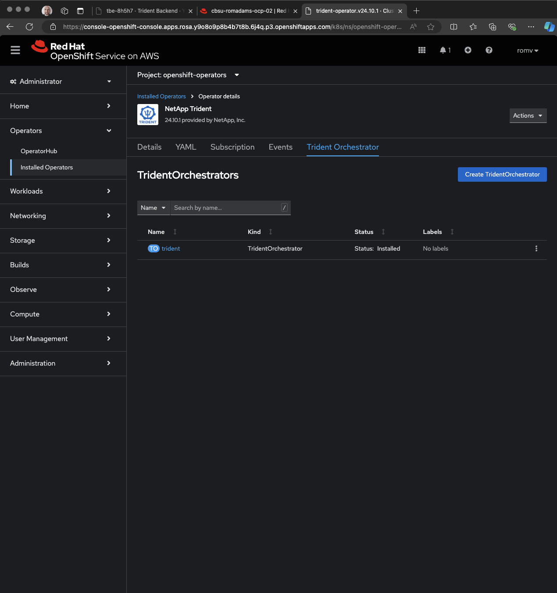

= Deploy the Trident operator on Red Hat OpenShift
:hardbreaks:
:icons: font
:imagesdir: ../media/

[.lead]
You can deploy the Trident operator to install Trident on Red Hat OpenShift. This process applies to installations where the container images required by Trident are not stored in a private registry.

.Before you begin 
Before you begin installation, log in to the Linux host and verify it is managing a working, link:requirements.html[supported Kubernetes cluster^] and that you have the necessary privileges.

NOTE: With OpenShift, use `oc` instead of `kubectl` in all of the examples that follow, and log in as *system:admin* first by running `oc login -u system:admin` or `oc login -u kube-admin`.

[%collapsible%open]
====
. Verify your Kubernetes version:
+
----
oc version
----
expected output:  

+
----
Client Version: 4.17.6
Kustomize Version: v5.0.4-0.20230601165947-6ce0bf390ce3
Kubernetes Version: v1.28.14+502c5ce
----

or using the ```About``` link from the Help ```?``` menu:


. Verify cluster administrator privileges:
+
----
oc auth can-i '*' '*' --all-namespaces
----
expected output:

+
----
yes
----

====

== Critical information about Trident 24.10
*You must read the following critical information about Trident.*

// Start snippet: collapsible block (open on page load)
.*Critical information about Trident*
[%collapsible%open]
====
=======
* Red Hat OpenShift 4.17 is supported in Trident. Upgrade Trident prior to upgrading Red Hat OpenShift.
* Trident strictly enforces the use of multipathing configuration in SAN environments, with a recommended value of `find_multipaths: no` in multipath.conf file. 
+
Use of non-multipathing configuration or use of `find_multipaths: yes` or `find_multipaths: smart` value in multipath.conf file will result in mount failures. Trident has recommended the use of `find_multipaths: no` since the 21.07 release.
====
// End snippet

== Deploy the Trident via the Red Hat OpenShift Console
Review link:../trident-get-started/kubernetes-deploy.html[the installation overview^] to ensure you've met installation prerequisites and selected the correct installation option for your environment.

=== Step 1: Deploy the Trident operator from OperatorHub 

Navigate to the ```Operators/OperaratorHub````, search for NetApp, and click on NetApp Trident:  

 

A pop-up might appear to inform you about the support of Trident is provided by NetApp and not Red Hat:


The Trident operator page will open providing all the necessary information about version and capabilities. Click the ```Install``` button to continue:


The installation page offers different customization to deploy the Trident operator. Proceed with the default most common parameters by clicking the ```Install``` button without modifying any settings.


Once install, navigate to ```Operators/Installed Operators``` and clieck on ```Netapp Trident```.


=== Step 2: Deploy the `TridentOrchestrator`

Now that the Trident operator is deployed, install the Trident Orchestrator by clicking ```Create instance```.


Click create.


Waiting for Trident Orchestrator to move to ```Instaled```



Navigating to ```Workloads/Pods``` and select ```Trident``` in Project will show the Trident Orchestrator components:


=== Step 2: Create the `TridentOrchestrator` CRD
Create the `TridentOrchestrator` Custom Resource Definition (CRD). You creates a `TridentOrchestrator` Custom Resources later. Use the appropriate CRD YAML version in `deploy/crds` to create the `TridentOrchestrator` CRD. 


== Deploy the Trident via the Red Hat OpenShift CLI

